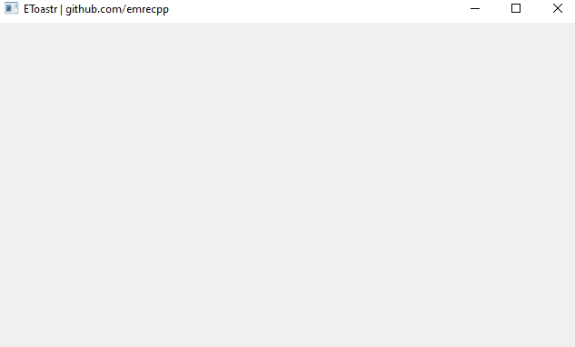
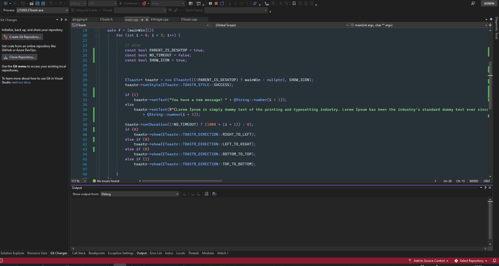
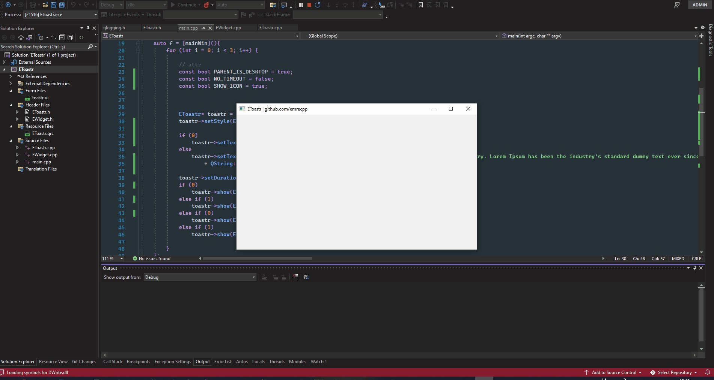

# EToastr
Animated Notification/Toastr component for C++/Qt

# EToastr Styles:
+ MESSAGE
+ SUCCESS
+ WARNING
+ INFO
+ FAIL


# EToastr Directions:
+ RIGHT_TO_LEFT
+ TOP_TO_BOTTOM
+ BOTTOM_TO_TOP
+ LEFT_TO_RIGHT


## Direction = RIGHT_TO_LEFT, Style = SUCCESS, ParentIsDesktop = false, NoIcon = false, NoTimeout = false




## Direction = LEFT_TO_RIGHT, Style = SUCCESS, ParentIsDesktop = false, NoIcon = ```true```, NoTimeout = false


## Direction = BOTTOM_TO_TOP, Style = SUCCESS, ParentIsDesktop = false, NoIcon = false, NoTimeout = ```true```


## Direction = TOP_TO_BOTTOM, Style = SUCCESS, ParentIsDesktop = ```true```, NoIcon = false, NoTimeout = false




## Direction = LEFT_TO_RIGHT, Style = ```INFO```, ParentIsDesktop = true, NoIcon = false, NoTimeout = false



# Please don't forget to star the project, thanks :) 
